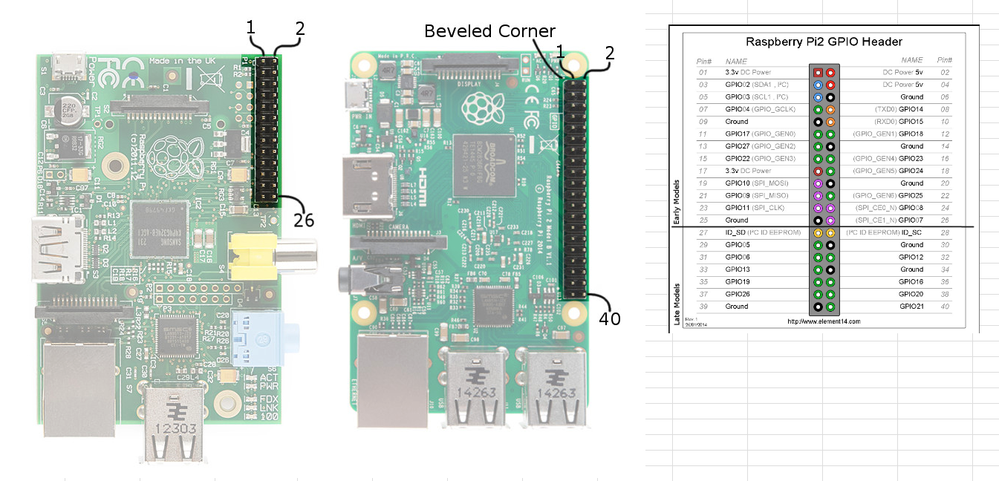

# IoT-LED-panel-matrix
Integrate Google Chat API with LED panel matrix

## Overview
This is a project setup as a starting point for the integration of Gchat API with IoT LED Matrix pannel.

Currently, contains script for reading messages from Google pub sub topic which are coming through Google chat API and the terraform scripts to create required infra

## Pre-requisite

- Create a Google Pub sub topic and a subscription - This will be done through terraform scripts (You may need to have a Google project)
- If you create a new project you can run the Terraform scripts to create required infra after login to the GCP cloud shell
    - cd infra
    - terraform init
    - terraform apply (Type yes when prompted)
- Enable Google chat API under API & Services section in Google Cloud Console
- Create a service account for the pub sub topic (This will be automatically created from Terraform scripts)
- Provide publisher access role of the created topic for the chat-api-push@system.gserviceaccount.com service account (This will be automatically created from Terraform scripts)
- Get a copy of your credential_file.json which should be copied to raspberrypi and same file will be referred from subscriber.py.
- You may need to connect to your raspberry pi module through ssh or wired connection and copy the credential_file.json
- Update software in respberrry pi module
    - sudo apt-get update
    - sudo apt-get upgrade -y
    - sudo apt-get update
    - sudo apt-get install -y git python3-dev python3-pillow
- Install pip
- Install google cloud pub sub using pip (pip install --upgrade google-cloud-pubsub)
- Set up wiring for the LED panel according to below diagram

- Inside the raspberry pi module clone https://github.com/hzeller/rpi-rgb-led-matrix.git repository.
- Build the binaries
    - cd rpi-rgb-led-matrix
    - make build-python PYTHON=$(which python3)
    - sudo make install-python PYTHON=$(which python3)
- Build the text-scroller utility
    - cd utils
    - make text-scroller
- Disable pi sound module since the library use the same hardware subsystem.
    - sudo sed -i 's/dtparam=audio=on/dtparam=audio=off/' /boot/config.txt
    - sudo bash -c "echo 'blacklist snd_bcm2835' > /etc/modprobe.d/blacklist-alsa.conf"
- In order to improve the display mode run the following command
    - sudo sed -i '$s/$/ isolcpus=3/' /boot/cmdline.txt
- Then reboot the system by running sudo reboot command.
- Now the text scroller utility is built inside rpi-rgb-led-matrix/utils/ folder

## Usage guide:

- First clone this repo locally inside raspberry pi module
- Copy the credential file downloaded for the service account created and replaced with iot-led-matrix-subscriber-credentials.json file inside credentials folder.
- Then copy both credentials folder and subscriber.py to same location as text-scroller utility (rpi-rgb-led-matrix/utils/) done in pre-requisite
- Replace the subscription name and credential_file details in the subscriber.py accordingly
- Run 'python subscriber.py' 
